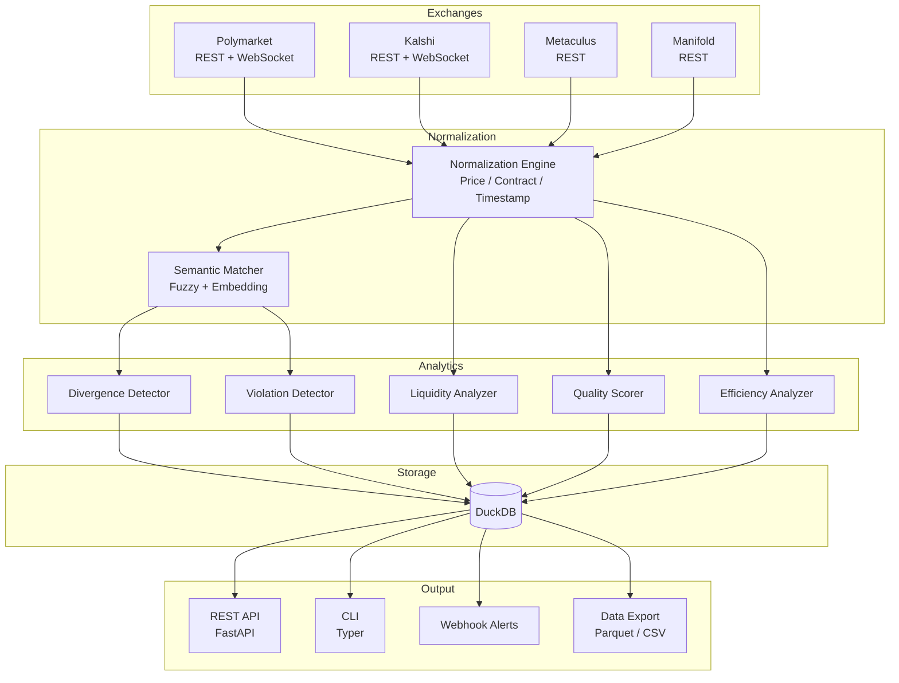

# arbiter

[](https://github.com/sushaan-k/arbiter/actions/workflows/ci.yml)
[](https://www.python.org/downloads/)
[](LICENSE)
[](https://github.com/astral-sh/ruff)

**Cross-exchange prediction market analytics engine.**

Arbiter ingests data from Polymarket, Kalshi, Metaculus, and Manifold Markets, normalizes it into a common schema, and runs analytics to detect cross-exchange price divergences, probability violations, liquidity profiles, and market quality metrics.

This is the **analytics layer** -- the telescope, not the gun.

---

## The Problem

Prediction markets are a multi-billion dollar asset class with zero open-source analytics infrastructure:

- No unified API to query multiple exchanges simultaneously
- No tools for cross-exchange price comparison or inefficiency detection
- No historical analysis of pricing efficiency over time
- No liquidity modeling or execution cost estimation
- Academic research papers reference $40M in arbitrage profits extracted from Polymarket alone, but the data tools to reproduce their findings don't exist publicly

## The Solution

```python
from arbiter import Arbiter, Exchange

async with Arbiter(
    exchanges=[
        Exchange.polymarket(api_key="..."),
        Exchange.kalshi(api_key="..."),
        Exchange.metaculus(),
        Exchange.manifold(),
    ]
) as arb:
    # Cross-exchange price divergences
    for d in await arb.divergences(min_spread=0.03):
        print(f"{d.event}: {d.spread_pct:.1%} spread "
              f"({d.exchange_a.value} vs {d.exchange_b.value})")

    # Probability violations (YES + NO != 1.0)
    binary_v, multi_v = await arb.violations()

    # Liquidity analysis with price impact estimation
    liq = await arb.liquidity("polymarket", market_id="...")

    # Real-time monitoring
    async for alert in arb.monitor(divergence_threshold=0.03):
        print(f"ALERT: {alert.message}")

    # Research-grade data export
    await arb.export_dataset("markets_2026.parquet")
```

## Quick Start

```bash
pip install arbiter
```

For semantic market matching with sentence-transformers:

```bash
pip install "arbiter[matching]"
```

### Minimal Example

```python
import asyncio
from arbiter import Arbiter, Exchange

async def main():
    async with Arbiter(exchanges=[Exchange.manifold()]) as arb:
        markets = await arb.fetch_all_markets(limit=20)
        for name, market_list in markets.items():
            print(f"{name}: {len(market_list)} markets")
            for m in market_list[:3]:
                print(f"  {m.title}: YES={m.yes_price}")

asyncio.run(main())
```

### CLI

```bash
# Scan for divergences
arbiter scan --min-spread 0.03

# Limit the number of markets fetched per exchange during a scan
arbiter scan --limit 25

# Detect probability violations
arbiter violations --json

# Export data
arbiter export markets.parquet

# Start the API server
arbiter serve --port 8000
```

`arbiter serve` keeps refreshing divergences, violations, liquidity profiles,
and quality scores in the background so the API reflects the latest snapshot
instead of the startup scan.

## Architecture



## Core Analytics

### Cross-Exchange Price Divergence

When the same event is priced differently on two exchanges:

```python
Divergence(
    event="US Presidential Election 2028 -- Republican Nominee",
    outcome="DeSantis",
    exchange_a="polymarket",  price_a=0.23,
    exchange_b="kalshi",      price_b=0.19,
    spread=0.04,              # 4 cents
    spread_pct=0.174,         # 17.4% relative to mid
    net_arb_profit_estimate=1200,
)
```

### Probability Violations

Markets where YES + NO prices violate probability axioms:

```python
ProbabilityViolation(
    market="Will Bitcoin hit $200K by Dec 2026?",
    yes_price=0.35, no_price=0.68,
    price_sum=1.03,           # Should be <= 1.0
    implied_arb=0.03,         # Risk-free per contract
)
```

### Liquidity Analysis

```python
LiquidityProfile(
    best_bid=0.72, best_ask=0.74, spread=0.02,
    depth_at_1pct=15000,      # $ within 1% of mid
    estimated_impact={
        1000: 0.001,          # $1K moves price 0.1 cents
        100000: 0.035,        # $100K moves price 3.5 cents
    },
)
```

### Market Quality Scoring

```python
MarketQuality(
    exchange="polymarket", category="US Politics",
    brier_score=0.18,         # Lower is better
    calibration_error=0.03,
    manipulation_score=0.12,  # 0 = clean, 1 = severe
)
```

## API Reference

### `Arbiter`

| Method | Description |
|---|---|
| `fetch_all_markets()` | Fetch markets from all exchanges in parallel |
| `match_markets()` | Find equivalent markets across exchanges |
| `divergences(min_spread, min_liquidity, limit)` | Detect cross-exchange price divergences |
| `violations()` | Find probability violations |
| `liquidity(exchange, market_id)` | Analyze order book liquidity |
| `quality(exchange, category)` | Compute market quality scores for a configured exchange |
| `monitor(divergence_threshold)` | Real-time monitoring (async generator) |
| `export_dataset(path)` | Export to Parquet |

### `Exchange` Factory

```python
Exchange.polymarket(api_key=None, api_secret=None)
Exchange.kalshi(api_key=None, api_secret=None)
Exchange.metaculus()
Exchange.manifold(api_key=None)
```

### REST API

Start with `arbiter serve`, then:

| Endpoint | Description |
|---|---|
| `GET /health` | Health check |
| `GET /api/v1/divergences` | Current divergences |
| `GET /api/v1/violations/binary` | Binary probability violations |
| `GET /api/v1/violations/multi` | Multi-outcome violations |
| `GET /api/v1/liquidity/{market_id}` | Liquidity profile |
| `GET /api/v1/quality/{exchange}` | Quality metrics |

## Project Structure

```
arbiter/
  src/arbiter/
    __init__.py           # Public API + Exchange factory
    engine.py             # Main Arbiter orchestrator
    models.py             # Pydantic data models
    exceptions.py         # Exception hierarchy
    storage.py            # DuckDB storage layer
    cli.py                # Typer CLI
    exchanges/
      base.py             # Abstract exchange interface
      polymarket.py       # Polymarket connector
      kalshi.py           # Kalshi connector
      metaculus.py        # Metaculus connector
      manifold.py         # Manifold connector
    matching/
      semantic.py         # Semantic market matching
      normalizer.py       # Price normalization
    analytics/
      divergence.py       # Cross-exchange divergence detection
      violations.py       # Probability violation detection
      liquidity.py        # Liquidity analysis
      quality.py          # Market quality scoring
      efficiency.py       # Efficiency metrics
    output/
      api.py              # FastAPI REST API
      dashboard.py        # Dashboard endpoints
      alerts.py           # Webhook alerts
      export.py           # Parquet/CSV export
  tests/                  # pytest + pytest-asyncio
  examples/               # Runnable examples
```

## Development

```bash
git clone https://github.com/sushaan-k/arbiter.git
cd arbiter
python -m venv .venv && source .venv/bin/activate
pip install -e ".[dev]"

# Run tests
pytest

# Lint
ruff check src/ tests/

# Type check
mypy src/arbiter/
```

## Research References

- "Arbitrage Profits in Prediction Markets" (SSRN, 2025) -- $40M in Polymarket arbitrage documented across 86 million bets
- "Polymarket leads Kalshi in price discovery when liquidity is high" (SSRN, 2025)
- "AI Agents Are Quietly Rewriting Prediction Market Trading" (CoinDesk, March 2026)
- Kalshi API documentation (kalshi.com/docs)
- Polymarket API documentation (docs.polymarket.com)

## Contributing

Contributions welcome. Please open an issue first to discuss the change you'd like to make.

1. Fork the repo
2. Create a feature branch
3. Add tests for any new functionality
4. Run `pytest`, `ruff check`, and `mypy` before submitting
5. Open a PR

## License

[MIT](LICENSE)
